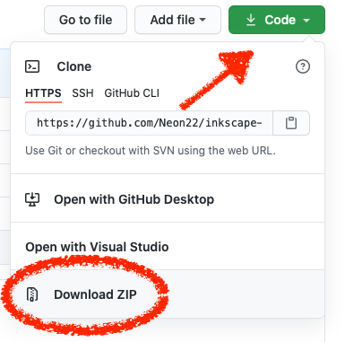

# Inkscape viðbætur (e. extension)

- [Uppsetning](#uppsetning)
- [Notkun](#notkun-á-lasercut-box)

## Uppsetning

Til að búa til kassan utan um Arduino tölvuna og brauðbretti ætlum við að nota viðbót við Inkscape forritið.

Viðbótin heitir *LaserCutBox* sem sækja má [hér](https://github.com/Neon22/inkscape-LasercutBox). Smelltu á Code og svo Download ZIP.



Næst þarf að afþjappa zip skránni og taka skrárnar með ```.py``` og ```.inx``` endingunum og setja þær í ```extensions``` möppuna fyrir Inkscape:

**Fyrir Windows:**

```bash
%AppData%\Inkscape\extensions
```

Einfaldast að afrita slóðina hér fyrir ofan og líma hana í Explorer gluggann í Windows:


**Fyrir MacOS**

Keyra skipunina hér fyrir neðan í Terminal til að opna ```extensions``` möppuna í Finder:

```bash
open /Applications/Inkscape.app/Contents/Resources/share/inkscape/extensions
```

**Fyrir Linux**

Mismunandi en algeng staðsetning:

```bash
~/.config/inkscape/extensions
```

Til að sjá hvar ```extensions``` mappan er má alltaf fara í *Preferences -> System* í Inkscape. Þar er listi yfir allar möppur sem Inkscape notar.

## Notkun á Lasercut Box

Þegar viðbótin hefur verið sett í rétta möppu þarf að endurræsa Inkscape.

Viðbótina má svo finna í *Extensions -> Render -> Lasercut Box...*

Stillingar sem á að nota:
- Í *Dimensions* flipanum:
  - Units: mm
  - Material Thickness: 3.1
- Í *Laser Kerf* flipanum:
  - Kerf (amount lost to laser): 0.2
  - Gott að haka í *Display Line width = kerf*

Myndband sem sýnir helstu atriði varðandi hönnun á kassa er [hér](https://youtu.be/8KpXsQQ8bqo).
