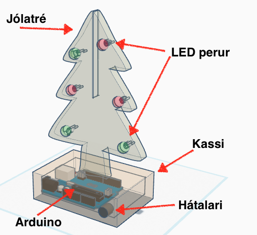
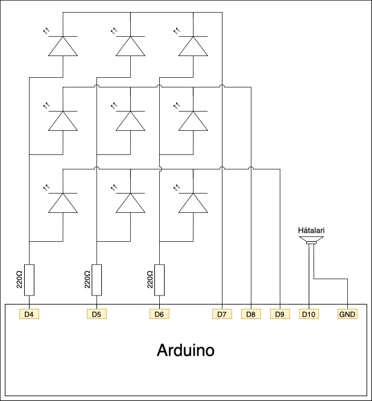

# Lokaverkefni (30%)

## Verkefnalýsing

### Syngjandi jólatré

Í þessu verkefni ætlar þú að hanna og smíða syngjandi jólatré. Jólatréð þarf að standa á kassa en í honum á að vera Arduino tölvan og hátalari. Jólatréð er svo skreytt með 9 LED perum sem blikka í takt við jólalögin sem Arduino tölvan spilar.

Kassann (mæli með 60*80 innanmál) og jólatréð á að hanna í Inkscape.

### Dæmi um útfærslu

### Rafrásarteikning

### Lóðun á Veroborði

### Íhlutir

- 9 mislitar LED perur.
- 3 viðnám 220&#8486; (eða 330&#8486;).
- Header
- Veroboard
- Piezo hátalari (passívur).

### Kóði

Kóðann fyrir verkefnið má finna [hér](../Kodi/vesm1_lokaverkefni_h20.ino). Ef þú settir [*ToneLibrary*](https://github.com/VESM1VS/H20/blob/master/Kennsluefni/arduino_uppsetning.md#auka-forritasöfn) ekki inn þegar þú gerðir verkefni 5 þarftu að gera það.

## Námsmat

- Hönnun í Inkscape (50%)
- Lóðun (50%)

## Skil verkefnisins

Haltu utan um allt sem tengist verkefninu á github svæðinu sem þú átt fyrir áfangann.

Þar á að vera:

- Svg skrá með teikningunum af jólatrénu og kassanum.
- Ljósmynd sem sýnir lóðunina.
- Myndband sem sýnir virkni verkefnisins (mundu að láta nafnið þitt og dagsetningu koma fram í myndbandinu).
